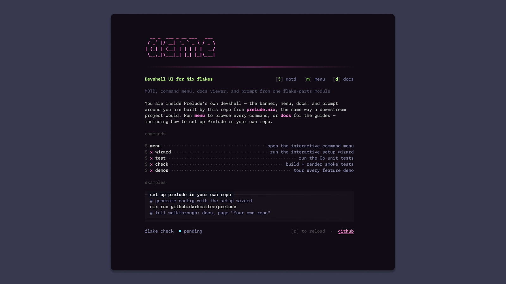
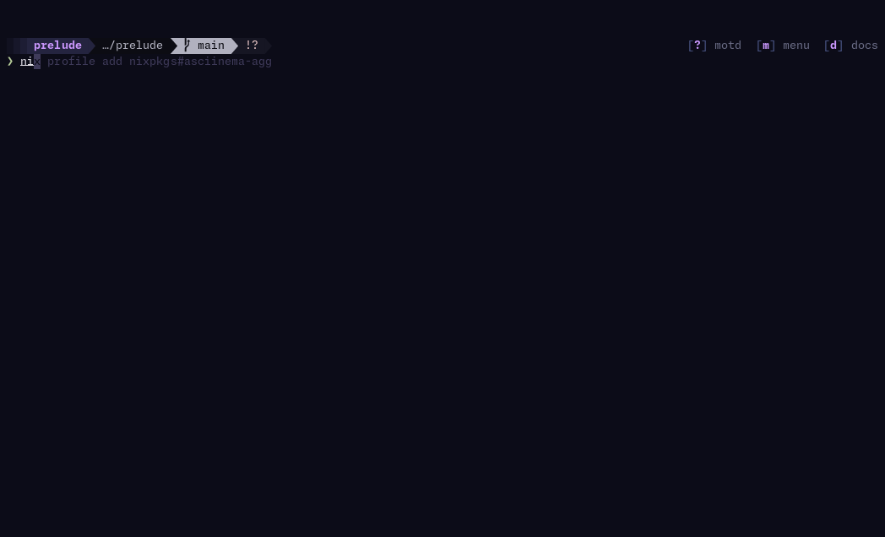
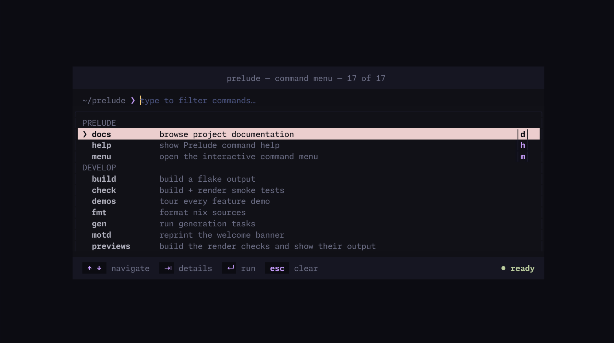
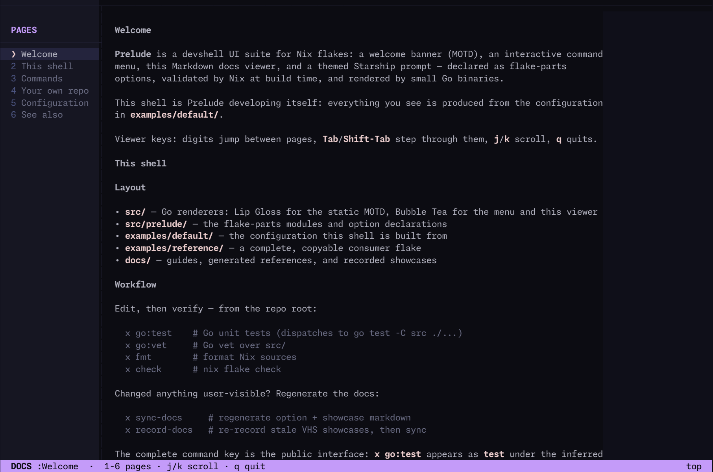

<div align="center">
  
  <br/><strong>A fancy entrypoint for your devshell</strong><br/>
  <sub>Conventional commands • Documentation TUI • Powerful command menu • Highly customizable • Beautiful themes</sub><br /><br />
</div>

Prelude is a DX-focused utility that provides a consistent, beautiful interface for your devshell. It's built on the idea that programs should be self-documenting, and that the information about _how_ to use a program (docs) should be available close to _where_ you run that program. Flakes help make this true for dependencies as well - use `docs` to learn about the current project, or `nix run github:org/repo#docs` to learn about any prelude-enabled dependency.

With prelude, the only command anyone would need to remember is `nix develop`. At shell entry, they are greeted with a nice MOTD:



This should contain an overview of what your project is, and clear instructions for
the most common tasks. Ideally, the user should be able to go from clone to running
with just the information shown on your MOTD.

Of course, not all details relevant to your project could fit on the MOTD — for that,
use the command menu and the docs:

## Quickstart (Setup Wizard)

<br />

Prelude ships with a setup wizard that generates the initial configuration for you. It writes a ready-to-use config and a sibling FIGlet title file (default `prelude.nix` + `title.txt`):

```bash
$ nix run github:darkmatter/prelude#setup
# or: nix run github:darkmatter/prelude#setup -- -o path/to/prelude.nix
```

### Command Menu



All tasks that one would need to perform should ideally be accessible here. You can
include very detailed documentation, since pressing tab will expand the detail section
which has plenty of room for prose.

To avoid prelude becoming an extra thing you have to maintain, we include utilities such
as `prelude.lib.fromPackageJson` which will import any scripts in your `package.json`,
so the command menu doesn't drift.

### Docs



Docs are incredibly simple to use, since they just parse markdown in your repo:

```nix
{
  prelude.docs = {
    enabled = true;
    pages = [
      { text = import ./README.md; title = "README"; }
      { text = import ./docs/foo.md; title = "Foo"; }
    ];
  };
}
```

## Usage

```nix
{
  inputs.prelude.url = "github:darkmatter/prelude";

  outputs = { prelude, flake-parts, ... }@inputs:
    flake-parts.lib.mkFlake { inherit inputs; } {
      imports = [ prelude.flakeModules.default ];

      systems = [ "x86_64-linux" "aarch64-darwin" ];

      prelude = {
        theme = "phosphor";
        project = "acme-web";
        motd = {
          enable = true;
        };
        menu.enable = true;
        docs.pages = [
          { text = ./docs/getting-started.md; }
          { text = ./docs/commands.md; }
        ];
      };

      perSystem = { pkgs, config, ... }:
        let
          hello = pkgs.writeShellApplication {
            name = "hello";
            text = ''echo "hello from the devshell"'';
          };
          helloApp = {
            type = "app";
            program = pkgs.lib.getExe hello;
          };
          packages = {
            inherit hello;
            default = hello;
          };
          apps = {
            hello = helloApp;
            default = helloApp;
          };
          checks.hello = hello;
        in
        {
          inherit packages apps checks;

          prelude.commands.hello = prelude.lib.fromPkg packages.hello {
            description = "say hello from this project";
            motd = 1;
          };

          devShells.default = pkgs.mkShell {
            packages = [
              config.packages.motd
              config.packages.docs
            ];
            shellHook = "motd";
          };
        };
    };
}
```

Entering the devshell prints the MOTD; `menu` opens the interactive picker and
`docs` opens the configured Markdown pages.

### Package-backed commands

Prelude keeps ordinary flake-parts outputs as the source of truth. Bind
`packages`, `apps`, and `checks` with normal Nix values, inherit them into the
per-system result, and adapt only the packages you want in the command catalogue:

```nix
prelude.commands.dev = prelude.lib.fromPkg packages.dev {
  arguments = [ "serve" ];
  description = "start the development server";
};
```

`fromPkg package extras` resolves `meta.mainProgram` (or an explicit `program`),
shell-escapes `arguments`, and carries the package into the generated menu
closure. The returned value is an ordinary Prelude command, so it composes with
literal command definitions and future collection adapters without introducing
a second output schema.

### The menu

```
menu              # fuzzy-filter picker over all commands
menu dev          # run a command by name
menu d            # …or by its single-key accelerator
menu dev --port 80  # extra CLI args skip argument entry
menu list         # print the command table (non-interactive)
menu help         # man-style manual generated from the config
```

The interactive picker is a Go/bubbletea TUI (config baked to JSON at build
time, one shared binary per system):

| Keys                | Action                                                   |
| ------------------- | -------------------------------------------------------- |
| type                | filter commands (name, usage, description, group)        |
| `↑` `↓` / `⌃n` `⌃p` | move selection                                           |
| `⇥`                 | list: expand details · args: cycle suggested-value chips |
| `↵`                 | run selection / append focused chip / submit args        |
| `esc`               | collapse → clear query → quit; args: back to list        |
| backspace (empty)   | args: back to the list                                   |

Selecting a command with declared `args` opens argument entry: every argument
is listed with its token, a required/flag/optional tag, description, and
suggested values as chips; a live `$ command` preview updates as you type.
Required arguments are validated on submit. The assembled command is
`exec`'d via `bash -c` — set `prelude.menu.execute = false` to print it
instead. Set `PRELUDE_MENU_DEBUG=<path>` to log TUI events for debugging.

### The docs viewer

Each Markdown file is one navigable page. Declaring pages enables the docs
package automatically; the first `# Heading` becomes the sidebar label.

```nix
prelude.docs = {
  pages = [
    { text = ./docs/getting-started.md; }
    { text = ./docs/commands.md; }
  ];
};
```

Pages support ordinary Markdown such as headings, lists, emphasis, links, and
fenced code blocks. Use digits to jump between pages, `Tab`/`Shift-Tab` to
step through them, `j`/`k` to scroll, and `q` to quit.

## Themes

`prelude.theme` selects a palette: `phosphor` (default), `minted` (indigo-black
with sage + rose), `amber`, `solarized`, `nord`, `gruvbox`, and `paper` (light)
— ported from the cli-menu-design demo — plus `mono` (strict dark grayscale)
and `apathy` (ported from czxtm/apathy-theme: purple-tinted darks, lavender +
butterscotch accents). Page through the current MOTD in every theme with
`nix run .#example-themes`.

Tokens: `fg`, `muted`, `dim`, `border`, `accentBorder`, `accent`,
`accent2`, `success`, `warning`, `info`, `error`, `selectionFg`, `bg`,
`surface`, and `secondary`. Semantic status colors are defined independently
for every theme; other values are converted from the design's oklch definitions
with CSS Color 4 gamut mapping.
Override any of them via `prelude.palette`:

```nix
prelude = {
  theme = "nord";
  palette.accent = "#88c0d0";
};
```

Explicit colors on text items always beat the theme; `foreground = null`
(the default) means "use the theme's role color".

### Color depth

The palettes are truecolor hex. The Go renderers use the terminal environment
and output capabilities to select the effective color depth:

| Environment                            | Result                      |
| -------------------------------------- | --------------------------- |
| `COLORTERM=truecolor` + 256-color TERM | 24-bit color (`38;2;r;g;b`) |
| no `COLORTERM` (e.g. Apple Terminal)   | quantized to 256 (`38;5;n`) |
| `TERM=screen` (default tmux)           | no color at all             |
| piped / non-tty                        | no color at all             |

If colors look flat, set `prelude.colorProfile = "truecolor"` to force 24-bit
output. `"ansi256"` forces quantization instead; `"auto"` (default) detects the
terminal profile. For tmux, the cleaner global fix is advertising truecolor:
`set -ga terminal-features ',*:RGB'` (or `terminal-overrides ',*:Tc'`).

## Command schema

`prelude.commands` is keyed by the public command name used by `x`. Prelude adds
`menu` and `help` whenever the menu is enabled, plus `docs` whenever documentation
pages exist.

The first colon derives menu presentation while the complete key remains public:
`go:test` appears as `test` under `go` and runs as `x go:test`. Additional colons
remain in the displayed suffix (`test:unit:watch` → group `test`, name
`unit:watch`). Ungrouped commands appear under `develop`.

Commands feed the interactive menu; only deliberately ungrouped commands become
convenience executables:

| Field         | Type        | Default    | Description                                                              |
| ------------- | ----------- | ---------- | ------------------------------------------------------------------------ |
| `description` | str         | `""`       | One-line description.                                                    |
| `exec`        | str / null  | key suffix | Shell command executed by the menu.                                      |
| `invocation`  | str / null  | `exec`     | Canonical underlying command metadata; exact duplicates fail evaluation. |
| `key`         | str / null  | `null`     | Single-key accelerator (`menu <key>`).                                   |
| `usage`       | str / null  | `null`     | Usage form shown in the menu details.                                    |
| `details`     | str / null  | `null`     | Extended description shown before argument entry.                        |
| `examples`    | list of str | `[ ]`      | Worked example invocations.                                              |
| `args`        | list of arg | `[ ]`      | Arguments; presence triggers arg-entry mode in the menu.                 |

Package-backed commands belong under `perSystem` and use `prelude.lib.fromPkg`:

```nix
prelude.commands."quality:lint" = prelude.lib.fromPkg pkgs.eslint {
  arguments = [ "." ];
  description = "lint the project";
};

sort.groups = [
  "develop"
  "quality"
];
```

`meta.mainProgram` selects the binary; use `program = "name"` for another
binary. `arguments` are shell-escaped and appended. The package is bundled into
`packages.menu` automatically. `fromPkg` derives a clean canonical invocation
from the executable basename plus arguments (`go test …`, never a Nix store
path). Grouped entries do not receive wrappers. `prelude.lib.mkCommand` remains
the lower-level constructor for callers that need to choose between `package`,
`executable`, or raw `command` sources.

Argument: `{ token, description ? "", required ? false, boolean ? false,
options ? [ ] }`. Tokens starting with `--` insert as `--flag value`;
anything else (e.g. `<remote>`, `name`) inserts positionally; `boolean`
tokens insert as-is when confirmed.

`x` and the menu share one catalogue and execution path. Every menu entry runs
through its complete, globally unique key (`x test`, `x go:test`,
`x test:unit:watch`), so no source or discriminator model is needed. See the
[command conventions](docs/guides/command-conventions.md).

Evaluated packages expose this result for downstream composition and checks:
`config.packages.menu.commandNames` lists menu selectors,
`commandInvocations` lists canonical shell forms, `commandWrapperNames` lists
only deliberate ungrouped aliases, and `commandWrappers` contains the wrapper
derivations actually built.

### MOTD commands

A command appears on the MOTD Getting Started list when its `motd` field is
set to an integer sort order. Commands with `motd = null` (the default) are
hidden, except `menu`: when the menu is enabled it is always listed first
(override with an explicit `motd` order) as the bare command `menu` — no `x`
prefix — so newcomers can open the command palette. Other navigation commands
(`help`, `docs`) stay off this list. Displayed commands and descriptions are
derived from `prelude.commands`, so they cannot drift from the runnable menu
commands.

```nix
prelude.commands.check = {
  description = "verify the flake";
  exec = "nix flake check";
  motd = 1;  # shown on the MOTD after menu, sorts first among project rows
};
```

Rows sort ascending by `motd`, ties broken by command name. Project rows render
as `x <name>` (the catalogue dispatch form); `menu` renders bare. When the
menu is enabled, `packages.motd` carries the menu, runtime packages, and
deliberate ungrouped wrappers; grouped commands remain available through their
canonical executable.

`config.packages.motd.commandNames` exposes selected command names,
`commandInvocations` exposes the canonical strings rendered by the MOTD, and
`commandWrappers` exposes only the deliberate ungrouped aliases bundled through
the menu. Direct `mkMotd` consumers and configurations without the menu start
with no command catalogue.

### MOTD recipes

`prelude.motd.recipes` describes polished, project-specific workflows separately
from single-command next steps. Recipes should cover setup, build, test, deploy,
and similar work rather than Prelude navigation. They are keyed by name and sort by `order`,
then key; `title` defaults to the key. Prefer structured `steps`.

```nix
prelude.motd.recipes.clean-local-stack = {
  title = "spin up a clean local stack";
  steps = [
    { comment = "start postgres + redis first"; }
    { command = "just db:up"; }
    { command = "just db:migrate && just db:seed"; }
    { command = "just dev"; }
  ];
};
```

Each step is either a `{ command }` (bold shell line) or a `{ comment }`
(dim `#` caption). Legacy `lines` (`#…` / free-form commands) still normalize
into steps at the Nix boundary.

### Generated FIGlet title

See the [title rendering guide](docs/guides/title-rendering.md) for the complete
interactive, stdout, recipe, and MOTD integration workflow. For a complete new
project configuration, run the setup flow:

```console
nix run .#setup
```

That writes `prelude.nix` and a sibling `title.txt` (override the config path
with `-o`; the title always lands next to it). The generated config is a full
options template: wizard choices are active, and every other supported option
is present as a commented default so the file doubles as documentation. See
[options reference](docs/reference/options.md) for the prose docs.

Prelude ships 23 selectable fonts: `3d-ascii`, `ansi-shadow`, `calvin-s`,
`computer`, `cricket`, `cybermedium`, `dos-rebel`, `dr-pepper`, `fender`,
`georgia11`, `halfiwi`, `kban`, `kompaktblk`, `larry3d`, `mini`, `roman`,
`slant`, `small-slant`, `speed`, `standard`, `thin`, `tubes-regular`, and
`univers`. Open the interactive title chooser:

```console
nix run .#title
```

The first screen is prefilled with the current directory name. Continue to a
one-style-per-page live preview, use arrows or `j`/`k` to move through the
bundled FIGlet fonts, and press enter to choose. The selected title is rendered
to stdout; pass `-o` to write it directly:

```console
nix run .#title -- -o title.txt
```

An explicit recipe can prefill both text and font, but is never discovered or
rewritten implicitly:

```nix
# title.nix
{
  text = "acme-web";
  font = "calvin-s";
}
```

```console
nix run .#title -- --recipe title.nix
nix run .#title -- --generate --recipe title.nix -o title.txt
```

Without `--recipe`, non-interactive `--generate` renders the current directory
name with the default font.

The original all-font stream remains available when a printable overview is
more useful than the chooser:

```console
nix run .#title-previews -- "acme-web"
```

Redirect stdout or check in an explicitly written file, then point the MOTD at it:

```nix
prelude.motd.title = {
  text = ./title.txt;
  align = "center"; # left, center, or right within the card
  style = "spine";  # project-name fallback when text is null
};
```

`--output` is the long form of `-o`; `--interactive` forces the chooser when
terminal detection is unavailable. Without either output flag, rendered FIGlet
text is the only stdout content. FIGlet is only used by the renderer; the MOTD
embeds and displays the resulting text. `motd.title.style` remains the
project-name fallback used only when `motd.title.text` is null.

## motd options (`prelude.motd.*`)

`description` is a styled text item (`{ text, foreground, background,
bold, italic, faint }`; null foreground uses the theme fg role).

See the [options reference](docs/reference/options.md) for the complete list of `prelude.motd.*` fields, types, and defaults.

Navigation shortcuts are internal: enabled MOTD, menu, and docs components add
`[?] motd`, `[m] menu`, and `[d] docs` respectively. Their aliases are installed
on `PATH`; consumers cannot hide a shortcut while its component is enabled.

## menu options (`prelude.menu.*`)

The filter and argument-entry prompt uses a blinking terminal bar cursor.

See the [options reference](docs/reference/options.md) for the complete list of `prelude.menu.*` fields, types, and defaults.

Group order is configured separately with top-level `sort.groups` (default:
`[ "develop" ]`). Prelude's own navigation group remains first.

> MOTD guidance is authored independently with exact runnable `commands` and
> multi-step `recipes`; command groups never render in the MOTD.

## prompt options (`prelude.prompt.*`)

A [starship](https://starship.rs/) config themed from the active palette.
`packages.prompt` is the generated `starship.toml`. The default layout starts
with two blank lines for breathing room, followed by a two-line prompt:
Powerline header with right-aligned shortcuts for enabled components on the
first line, marker on the second:

```
░▒▓ prelude  …/prelude   main  ✘»+⇡   ···  [?] motd  [m] menu  [d] docs
❯
```

Header: ramp + project pill on `secondary`, then continuous Powerline
transitions through a `bg` directory segment, an inverted `fg` branch
segment, and a `surface` status segment before returning to the terminal
background. Command duration and shortcuts remain transparent; shortcuts are
right-aligned via `$fill` (works in bash and zsh, while Starship's
`right_format` requires zsh or ble.sh). Marker: bold `success`, `error` on
failure. Styles reference palette tokens by name — the config carries
`palettes.prelude` mapping `bg`, `surface`, `secondary`, `fg`, `muted`, `dim`,
`accent`, `accent2`, `success`, `warning`, `info`, `error`, … to the resolved
theme, so `settings` overrides can use the same names (e.g.
`style = "fg:success"`).

See the [options reference](docs/reference/options.md) for the complete list of `prelude.prompt.*` fields, types, and defaults.

Wiring is one line — starship re-resolves `$STARSHIP_CONFIG` on every prompt
render, and direnv propagates env vars (only `PS1` itself is stripped):

```nix
devShells.default = pkgs.mkShell {
  shellHook = ''
    export STARSHIP_CONFIG=${config.packages.prompt}
  '';
};
```

Entering the project re-themes your prompt; leaving it (direnv unload) reverts
to your own starship config automatically. Requires starship to already be
your shell's prompt (`eval "$(starship init zsh)"` via home-manager or
similar); add `pkgs.starship` to the devshell packages for environments that
don't have it.

## Without flake-parts

```nix
prelude.lib.mkMotd
  { inherit (pkgs) lib writeText buildGoModule; }
  {
    theme = "gruvbox";
    project = "acme-web";
    header.tagline.text = "everything you need to build, test & ship";
    commandCatalog.dev = {
      description = "start local development";
      exec = "pnpm dev";
      motd = 1;
    };
  }
```

`lib.mkMotd` and `lib.mkMenu` take the component-specific configs the module
assembles; `lib.themes` exposes the palettes. Builder deps: motd needs
`{ lib writeText buildGoModule }`, menu needs
`{ lib writeShellApplication writeText buildGoModule }`. The overlay
(`overlays.default`) provides `pkgs.prelude.mkMotd` / `mkMenu` with deps
pre-applied.

## Demos

This flake dogfoods like a consumer: it imports [`prelude.nix`](prelude.nix)
next to `flakeModules.default`, with docs pages under [`docs/`](docs/).
`nix develop` greets you with Prelude's own MOTD, and `menu` drives the project
from inside the shell. `.#motd` and `.#menu` are this repo's real UI;
`.#example-motd` / `.#example-menu` carry the separate acme-web showcase configs.

```sh
nix develop                   # our own motd + menu, built by our own module
nix run .#motd                # this repo's welcome banner
nix run .#menu                # this repo's command menu (try: nix run .#menu -- list)
nix run .#previews            # build the render checks and show their output
nix run .#previews -- motd-renders   # …or just specific checks
nix run .#example-motd        # acme-web welcome banner demo
nix run .#example-menu        # acme-web command menu demo (arg entry)
nix run .#examples            # render every demo in sequence
nix run .#example-themes      # page through the current motd in every theme
nix run .#example-minimal     # standalone banner + styled description (the old card look)
nix run .#example-surface     # background fill, status chips, thick border
```

## Generated documentation

The [terminal showcase](docs/generated/showcases.md) is rendered from the real
example packages with [VHS](https://github.com/charmbracelet/vhs). It includes
animated MOTD/menu recordings, still PNGs, and the exact Nix configuration used
for each recording. The [options reference](docs/reference/options.md) is built
from the module declarations with `nixosOptionsDoc`.

```sh
nix run .#docs-sync           # regenerate deterministic Markdown
nix run .#docs-record         # record stale GIF/PNG media, then sync Markdown
```

`nix flake check` compares committed Markdown and media fingerprints with their
generator inputs. CI runs `docs-record` after every writable branch push and
auto-commits changes under `docs/` when regeneration is needed.

## Layout

```
flake.nix              # canonical outputs + flakeModules.default
prelude.nix            # dogfood config (same shape as setup output)
nix/prelude-*.nix      # MOTD / menu / docs imports used by prelude.nix
nix/docs-automation.nix # VHS tapes, fingerprints, docs apps + freshness checks
nix/*-demo-builder.nix  # final demo packages shared by apps and recordings
examples/reference/    # standalone downstream consumer example
docs/                  # docs-viewer pages, guides, generated references, media
src/motd/              # Go source for the static MOTD renderer (Lip Gloss)
src/menu-tui/          # Go source for the menu TUI (Bubble Tea)
src/prelude/
  themes.nix           # palettes (oklch → hex, CSS gamut-mapped)
  defaults.nix         # shared defaults for module + direct consumers
  lib.nix              # shared palette/config normalization helpers
  option-types.nix     # option types/builders shared by options/*.nix
  options/             # prelude.* option declarations
    shared.nix         #   theme, palette, colorProfile, project, groups
    motd.nix menu.nix
  motd.nix             # mkMotd — Go renderer + normalized JSON config
  menu.nix             # mkMenu — Bubble Tea renderer + normalized JSON config
  module.nix           # flake-parts module: imports options/, wires perSystem
                       #   (wrapped for importApply — consume it via
                       #    flakeModules.default, not by importing the file)
  examples.nix         # runnable demos (nix run .#examples)
```
