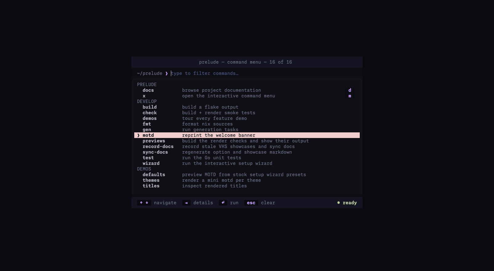
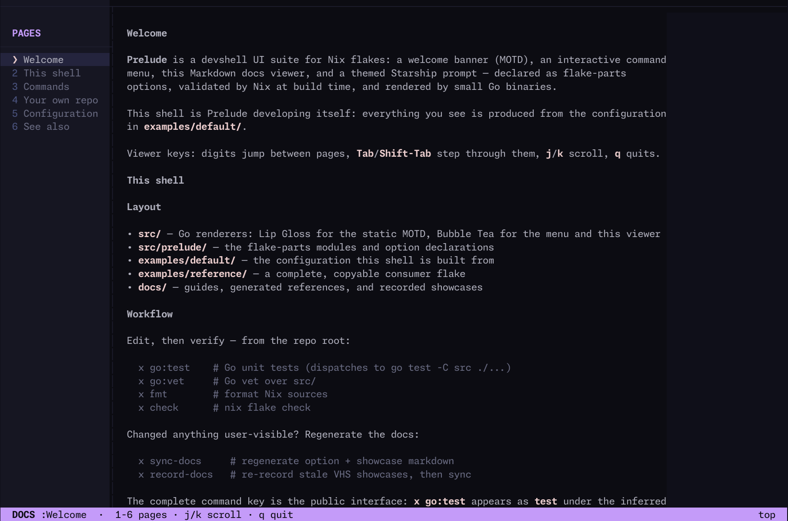

<div align="center">
  
  <br/><strong>Make your devshell easy to use and nice to look at</strong><br/>
  <br />
</div>

A flake-parts module that greets `nix develop` with a MOTD, command picker, docs viewer, and themed prompt.

Prelude keeps docs next to where you run the project. `docs` explains this repo; `nix run github:org/repo#prelude -- docs` explains any prelude-enabled dependency. The only command to remember is `nix develop`.

<br />
<div align="center">

</div>
<br />

## Quickstart (Setup Wizard)

The wizard writes `prelude.nix`, a sibling `title.txt`, and a project-root `.envrc` (`use flake` plus preflight):

```bash
nix run github:darkmatter/prelude -- wizard

# or:
nix run github:darkmatter/prelude -- wizard -o nix/prelude.nix
```


Import the generated sidecar — it never overwrites an existing `flake.nix`:

```nix
imports = [
  inputs.prelude.flakeModules.default
  ./prelude.nix
];
```

The generated file lists every option as a commented default. Put clone-to-running steps on the MOTD; put the rest in the command catalogue (`x`) and Markdown docs.

### Command picker



```
x                 # open the interactive picker
x dev             # run a command by catalogue key
x d               # …or by its single-key accelerator
x --list          # print the command table
```

Adapt existing packages so the menu does not drift:

```nix
prelude.commands.dev = prelude.lib.fromPkg packages.dev {
  description = "start the development server";
  motd = 1;
};
```

`examples/typescript/` imports `package.json` scripts the same way.

### Docs



```nix
prelude.docs.pages = [
  { text = ./README.md; }
  { text = ./docs/getting-started.md; }
];
```

Each Markdown file is one page. Digits jump, `Tab` steps, `j`/`k` scroll, `q` quits.

## Usage

```nix
{
  inputs.prelude.url = "github:darkmatter/prelude";

  outputs = { prelude, flake-parts, ... }@inputs:
    flake-parts.lib.mkFlake { inherit inputs; } {
      imports = [ prelude.flakeModules.default ./prelude.nix ];
      systems = [ "x86_64-linux" "aarch64-darwin" ];

      perSystem = { pkgs, config, ... }: {
        devShells.default = pkgs.mkShell {
          packages = [ config.packages.prelude-shell ];
        };
      };
    };
}
```

`packages.prelude-shell` bundles every enabled component and activates via its setup-hook. For direnv, the wizard writes a matching `.envrc`.

Full consumer walkthrough: [Your own repo](docs/your-own-repo.md). Command keys and grouping: [command conventions](docs/guides/command-conventions.md). Options: [reference](docs/reference/options.md).

## Themes

`prelude.theme` selects a palette: `prelude`, `phosphor`, `minted`, `amber`, `solarized`, `nord`, `gruvbox`, `paper` (light), `mono`, `apathy`. Override tokens with `prelude.palette`. Preview every theme with `nix run .#example-themes`.

## Contributing

Questions and PRs are welcome via [GitHub issues](https://github.com/darkmatter/prelude/issues).

```sh
nix develop
x go:test
x check
```

User-visible docs changes: `x sync-docs` (and `x record-docs` if media is stale).

## License

[MIT](LICENSE) © 2026 Darkmatter
