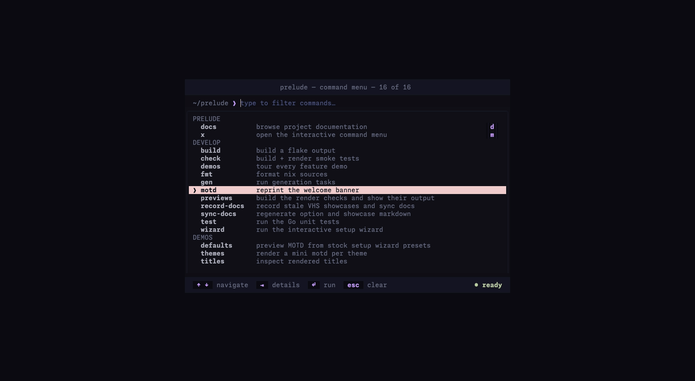
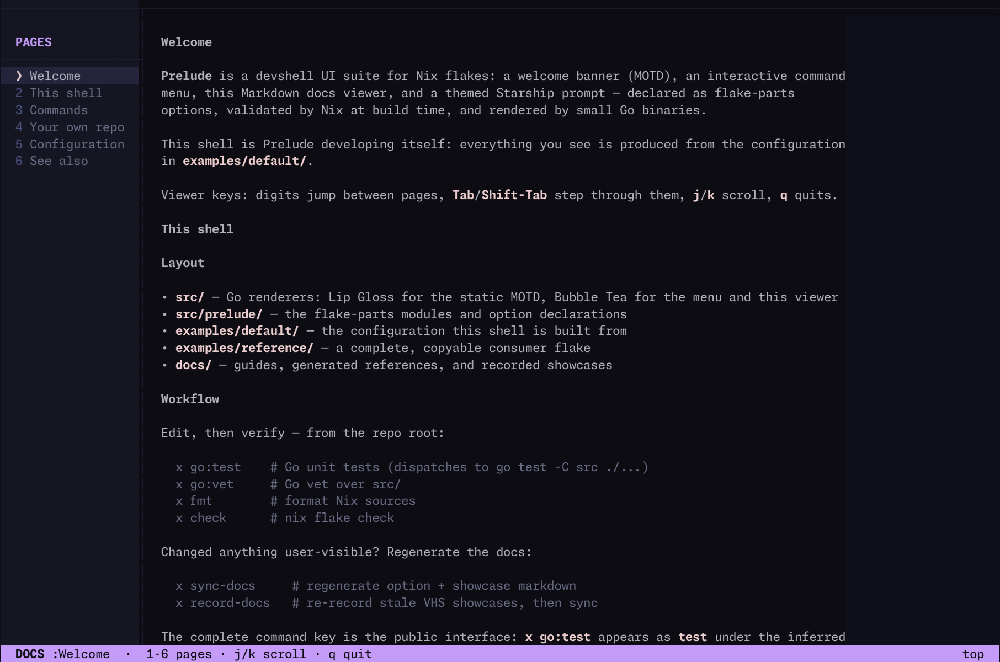

<div align="center">
  
  <br/><strong>Make your devshell easy to use and nice to look at</strong><br/>
  <br />
</div>

Greets `nix develop` with a MOTD, command picker, docs viewer, and themed prompt. Use it as a flake-parts module or, in any other flake (blueprint, a plain `outputs` function), through `prelude.lib.evalModule`.

Prelude keeps docs next to where you run the project. `docs` in the devshell explains this repo; `nix run github:darkmatter/prelude#docs` explains whatever checkout you are in, with its own Prelude theme and pages when it has them; `nix run github:org/repo#prelude-docs` explains a prelude-enabled dependency. The only command to remember is `nix develop`.

<br />
<div align="center">

</div>
<br />

## Quickstart (Setup Wizard)

The wizard writes `prelude.nix`, a sibling `title.txt`, and a project-root `.envrc` (`use flake` plus preflight):

```bash
nix run github:darkmatter/prelude -- wizard

# or:
nix run github:darkmatter/prelude -- wizard -o nix/prelude.nix
```


The wizard never overwrites an existing `flake.nix`; wire the sidecar in as [Install](#install) shows.

The generated file lists every option as a commented default. Put clone-to-running steps on the MOTD; put the rest in the command catalogue (`x`) and Markdown docs.

### Command picker



```
x                 # open the interactive picker
x dev             # run a command by catalogue key
x db migrate      # …a subcommand ("db migrate" or "db/migrate" in Nix)
x d               # …or by its single-key accelerator
x --list          # print the command table
```

Adapt existing packages so the menu does not drift:

```nix
prelude.commands.dev = prelude.lib.fromPkg packages.dev {
  description = "start the development server";
  motd = 1;
};
```

### Docs



```nix
prelude.docs.pages = [
  { text = ./README.md; }
  { text = ./docs/getting-started.md; }
];
```

Each Markdown file is one page. Digits jump, `Tab` steps, `j`/`k` scroll, `q` quits.

### Workspace

For an opt-in managed Bash with a movable docs/menu pane, launch explicitly from this repository:

```sh
nix run path:.#prelude-workspace
```

The catalogue also offers `x prelude:workspace`. Normal shell activation and consumer native closures are unchanged. See the [workspace guide](docs/guides/workspace.md) for controls, the opt-in `--starship` prompt, and limitations.

### TypeScript

Bun apps get the same picker, MOTD, and docs viewer from TypeScript. Commands are functions declared next to the code they run, with typed arguments:

```ts
export const preludeCommand = Command.make({
  description: "run the dev server",
  args: [{ token: "--port", type: "number", default: 3000 }],
  run: (args) => serve(args.port), // args.port: number
});

await Prelude.make({ project: "acme", commands: { dev: preludeCommand } }).main();
```

Install with `bun add @drkmttr/prelude`. Walkthrough: [`examples/typescript/`](examples/typescript/). API: [`ts/`](ts/README.md).

## Install

Add the input, then put `prelude-shell` in your devshell. It bundles every enabled component and activates through its setup-hook, so `nix develop` and direnv's `use flake` both show the MOTD. Both ways below read the same `prelude.nix` and build the same packages.

```nix
inputs.prelude.url = "github:darkmatter/prelude";
```

**With flake-parts**, import the module and the sidecar:

```nix
outputs = { prelude, flake-parts, ... }@inputs:
  flake-parts.lib.mkFlake { inherit inputs; } {
    imports = [ prelude.flakeModules.default ./prelude.nix ];
    systems = [ "x86_64-linux" "aarch64-darwin" ];

    perSystem = { pkgs, config, ... }: {
      devShells.default = pkgs.mkShell {
        packages = [ config.packages.prelude-shell ];
      };
    };
  };
```

**Without flake-parts** ([blueprint](https://github.com/numtide/blueprint), a plain `outputs` function), evaluate the sidecar with `prelude.lib.evalModule pkgs`:

```nix
# blueprint: devshell.nix
{ pkgs, inputs, ... }:
let
  prelude = inputs.prelude.lib.evalModule pkgs ./prelude.nix;
in
pkgs.mkShell {
  packages = [ prelude.packages.prelude-shell ];
}
```

The module receives `pkgs`, so package-backed commands go straight into `prelude.commands`; pass anything else it takes (`self`, `inputs`) through `_module.args`. A complete plain flake: [`examples/without-flake-parts/`](examples/without-flake-parts/).

A custom `shellHook` activates with `eval "$(prelude-preflight)"`.

### Reading docs without the devshell

`nix run github:darkmatter/prelude#docs` shows the docs of the repository you are in. It opens the flake's own `prelude-docs` package when there is one, so the project's theme, pages and hero apply; any other repository gets Prelude's defaults over its `README.md` and `docs/`. The same package serves `nix run github:org/repo#prelude-docs`.

With flake-parts, `packages.prelude-docs` exists as soon as `prelude.docs.pages` lists a page. Without it, expose the packages `evalModule` returns; `legacyPackages` keeps them out of `nix flake check`:

```nix
legacyPackages = forAllSystems (pkgs: (prelude.lib.evalModule pkgs ./prelude.nix).packages);
```

In blueprint, a package file does it: `packages/prelude-docs.nix`, with `prelude.nix` one directory up.

```nix
{ pkgs, inputs, ... }:
(inputs.prelude.lib.evalModule pkgs ../prelude.nix).packages.prelude-docs
```

Full consumer walkthrough: [Your own repo](docs/your-own-repo.md). Command keys and grouping: [command conventions](docs/guides/command-conventions.md). Options: [reference](docs/reference/options.md).

## Themes

`prelude.theme` selects a palette: `prelude`, `phosphor`, `minted`, `amber`, `solarized`, `nord`, `gruvbox`, `paper` (light), `mono`, `apathy`. Override tokens with `prelude.palette`. Preview every theme with `nix run .#example-themes`.

## Contributing

Questions and PRs are welcome via [GitHub issues](https://github.com/darkmatter/prelude/issues).

```sh
nix develop
x go:test
x check
```

User-visible docs changes: `x sync-docs` (and `x record-docs` if media is stale).

Render the README tour with `agg docs/recording.cast docs/recording.gif`. Preserve the cast's `term.theme` when replacing the recording so its terminal colors match Prelude instead of the renderer's fallback palette.

## License

[MIT](LICENSE) © 2026 Darkmatter
