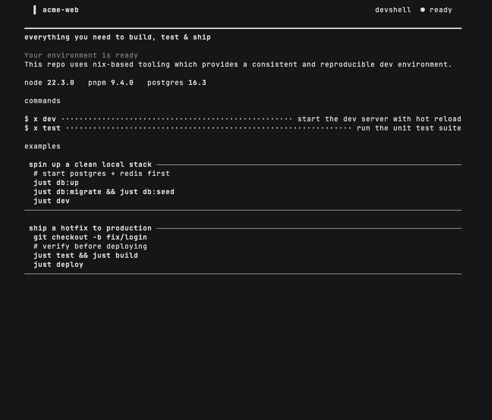
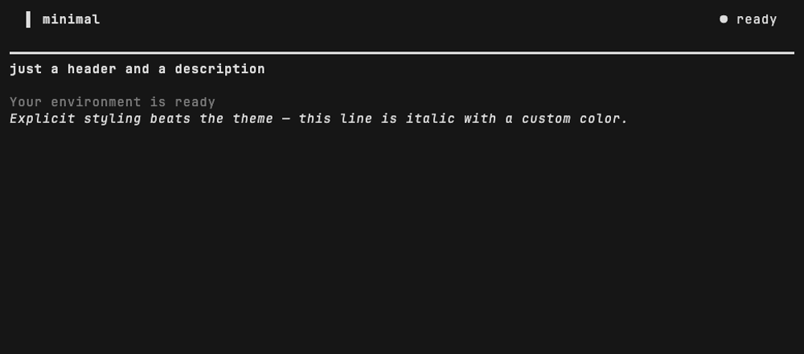
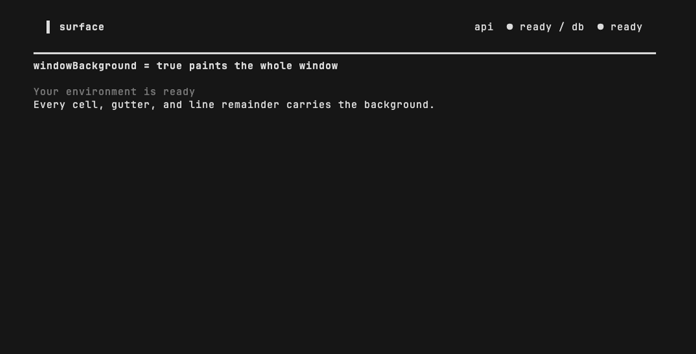
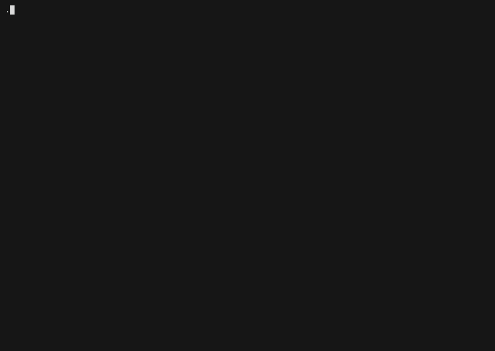

# Terminal showcases

> Generated by `nix run .#docs-sync`. Do not edit this file directly.

## Welcome banner

The MOTD composes project identity, static status, environment versions,
next-step commands, and recipes. Navigation shortcuts appear automatically
for enabled Prelude components.



A still image is available for renderers that do not animate GIFs:
[motd.png](../media/motd.png).

<details>
<summary>Show the configuration used for this recording</summary>

```nix
prelude = {
  commands = {
    build = {
      description = "compile an optimized production bundle";
      exec = "pnpm build";
    };
    "database:migrate" = {
      description = "apply pending schema migrations";
      exec = "drizzle-kit migrate";
    };
    "database:up" = {
      description = "start postgres & redis in the background";
      exec = "docker compose up -d db redis";
    };
    dev = {
      args = [
        {
          description = "Port to bind the dev server";
          options = [
            "3000"
            "8080"
          ];
          token = "--port";
        }
        {
          description = "Interface to expose";
          options = [
            "127.0.0.1"
            "0.0.0.0"
          ];
          token = "--host";
        }
      ];
      description = "start the dev server with hot reload";
      details = "Boots a development server that watches the source tree and hot-reloads modules as files change. Binds to 127.0.0.1:3000 by default; override with --port and --host.";
      examples = [
        "menu dev --port 8080"
        "menu dev --host 0.0.0.0"
      ];
      exec = "pnpm dev";
      motd = 1;
      usage = "menu dev --port 3000";
    };
    "general:clean" = {
      description = "remove build artifacts & caches";
      exec = "rm -rf .next .turbo node_modules/.cache";
    };
    "ops:deploy" = {
      args = [
        {
          description = "Publish to a named preview URL";
          options = [
            "staging"
            "preview"
          ];
          token = "--alias";
        }
        {
          boolean = true;
          description = "Print the manifest without shipping";
          token = "--dry-run";
        }
      ];
      description = "ship the current build to production";
      details = "Uploads the most recent production build and promotes it to the live environment. Deploys are atomic: traffic switches only after the new release passes its health checks.";
      examples = [
        "menu deploy --dry-run"
        "menu deploy --alias staging"
      ];
      exec = "vercel deploy";
      usage = "menu deploy --alias staging";
    };
    "ops:push" = {
      args = [
        {
          description = "Remote to push to";
          options = [
            "origin"
            "upstream"
          ];
          required = true;
          token = "<remote>";
        }
        {
          description = "Branch to publish";
          options = [
            "main"
            "dev"
          ];
          token = "<branch>";
        }
      ];
      description = "publish the current branch to the remote";
      exec = "git push";
    };
    test = {
      description = "run the unit test suite";
      exec = "pnpm test";
      motd = 2;
    };
  };
  motd = {
    clearScreen = false;
    description = {
      text = "This repo uses nix-based tooling which provides a consistent and reproducible dev environment.";
    };
    env = [
      {
        label = "node";
        value = "22.3.0";
      }
      {
        label = "pnpm";
        value = "9.4.0";
      }
      {
        label = "postgres";
        value = "16.3";
      }
    ];
    header = {
      status = {
        ready = {
          label = "devshell";
          status = "ready";
        };
      };
      tagline = {
        text = "everything you need to build, test & ship";
      };
    };
    margin = {
      top = 0;
    };
    recipes = {
      clean-local-stack = {
        steps = [
          {
            comment = "start postgres + redis first";
          }
          {
            command = "just db:up";
          }
          {
            command = "just db:migrate && just db:seed";
          }
          {
            command = "just dev";
          }
        ];
        title = "spin up a clean local stack";
      };
      ship-hotfix = {
        steps = [
          {
            command = "git checkout -b fix/login";
          }
          {
            comment = "verify before deploying";
          }
          {
            command = "just test && just build";
          }
          {
            command = "just deploy";
          }
        ];
        title = "ship a hotfix to production";
      };
    };
  };
  project = "acme-web";
};
```

</details>

### Explicit description styling

`prelude.motd.description.foreground` and `.italic` override the active
theme for one description, while `prelude.motd.align = "left"` keeps the
compact banner anchored to the terminal edge.



```nix
prelude = {
  motd = {
    align = "left";
    clearScreen = false;
    description = {
      foreground = "#8be9fd";
      italic = true;
      text = "Explicit styling beats the theme — this line is italic with a custom color.";
    };
    header = {
      tagline = {
        text = "just a header and a description";
      };
    };
    margin = {
      top = 0;
    };
  };
  project = "minimal";
};
```

### Full-window background

With `prelude.motd.clearScreen = true`, `windowBackground = true` paints
the entire cleared terminal with the theme background. Without clearing,
it fills the gutters and line remainders of emitted rows. Static keyed
statuses appear in the header without running environment probes.



```nix
prelude = {
  motd = {
    clearScreen = false;
    description = {
      text = "Every cell, gutter, and line remainder carries the background.";
    };
    header = {
      status = {
        api = {
          label = "api";
          order = 100;
          status = "ready";
        };
        db = {
          label = "db";
          order = 200;
          status = "ready";
        };
      };
      tagline = {
        text = "windowBackground = true paints the whole window";
      };
    };
    margin = {
      bottom = 1;
      top = 1;
    };
    windowBackground = true;
  };
  project = "surface";
};
```

## Interactive command menu

The menu demonstrates live filtering, command details, argument suggestion
chips, required-value validation, and a command preview. The recording
selects `dev`, opens its details, accepts the `--port 3000` chip, and types
`--host 0.0.0.0`.



A still of the final argument-entry state is available at
[menu.png](../media/menu.png).

<details>
<summary>Show the configuration used for this recording</summary>

```nix
prelude = {
  commands = {
    build = {
      description = "compile an optimized production bundle";
      exec = "pnpm build";
    };
    "database:migrate" = {
      description = "apply pending schema migrations";
      exec = "drizzle-kit migrate";
    };
    "database:up" = {
      description = "start postgres & redis in the background";
      exec = "docker compose up -d db redis";
    };
    dev = {
      args = [
        {
          description = "Port to bind the dev server";
          options = [
            "3000"
            "8080"
          ];
          token = "--port";
        }
        {
          description = "Interface to expose";
          options = [
            "127.0.0.1"
            "0.0.0.0"
          ];
          token = "--host";
        }
      ];
      description = "start the dev server with hot reload";
      details = "Boots a development server that watches the source tree and hot-reloads modules as files change. Binds to 127.0.0.1:3000 by default; override with --port and --host.";
      examples = [
        "menu dev --port 8080"
        "menu dev --host 0.0.0.0"
      ];
      exec = "pnpm dev";
      motd = 1;
      usage = "menu dev --port 3000";
    };
    "general:clean" = {
      description = "remove build artifacts & caches";
      exec = "rm -rf .next .turbo node_modules/.cache";
    };
    "ops:deploy" = {
      args = [
        {
          description = "Publish to a named preview URL";
          options = [
            "staging"
            "preview"
          ];
          token = "--alias";
        }
        {
          boolean = true;
          description = "Print the manifest without shipping";
          token = "--dry-run";
        }
      ];
      description = "ship the current build to production";
      details = "Uploads the most recent production build and promotes it to the live environment. Deploys are atomic: traffic switches only after the new release passes its health checks.";
      examples = [
        "menu deploy --dry-run"
        "menu deploy --alias staging"
      ];
      exec = "vercel deploy";
      usage = "menu deploy --alias staging";
    };
    "ops:push" = {
      args = [
        {
          description = "Remote to push to";
          options = [
            "origin"
            "upstream"
          ];
          required = true;
          token = "<remote>";
        }
        {
          description = "Branch to publish";
          options = [
            "main"
            "dev"
          ];
          token = "<branch>";
        }
      ];
      description = "publish the current branch to the remote";
      exec = "git push";
    };
    test = {
      description = "run the unit test suite";
      exec = "pnpm test";
      motd = 2;
    };
  };
  project = "acme-web";
};
```

</details>
