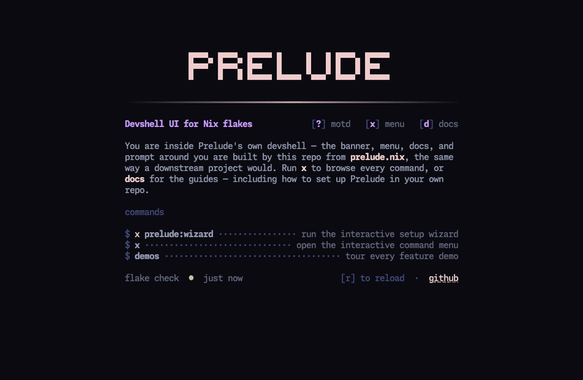
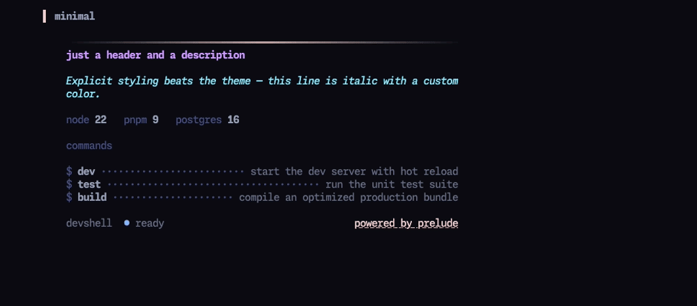
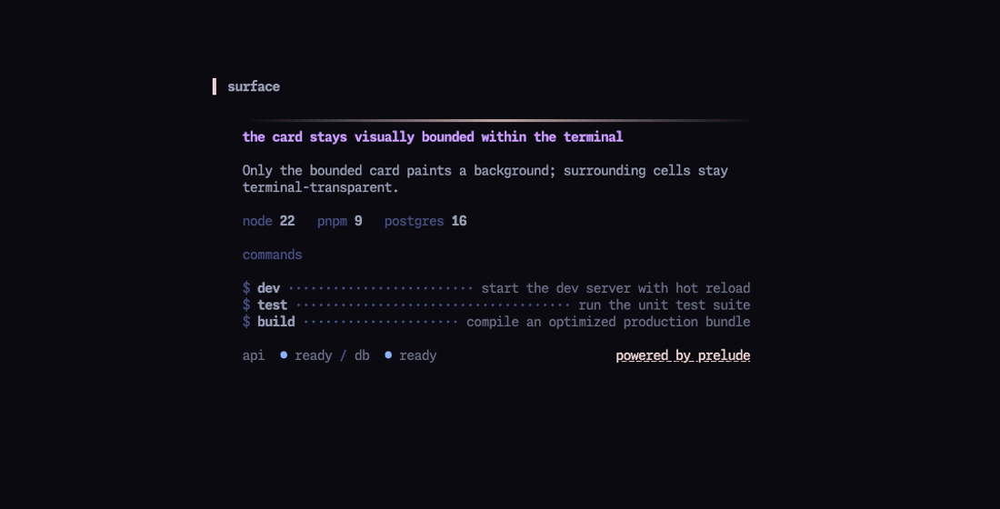

# Terminal showcases

> Generated by `nix run .#docs-sync`. Do not edit this file directly.

## Welcome banner

The MOTD composes project identity, header status, next-step commands,
and navigation shortcuts — all from the repo's own `prelude.nix`.



A still image is available for renderers that do not animate GIFs:
[motd.png](../media/motd.png).

<details>
<summary>Show the configuration used for this recording</summary>

```nix
prelude = {
  colorProfile = "truecolor";
  commands = {
    build = {
      args = [
        {
          description = "flake output to build";
          options = [
            ".#prelude-motd"
            ".#prelude-menu"
            ".#prelude-docs"
            ".#example-themes"
            ".#example-default"
          ];
          token = "<target>";
        }
      ];
      description = "build a flake output";
      exec = "nix build";
      usage = "x build .#prelude-motd";
    };
    check = {
      description = "build + render smoke tests";
      exec = "nix flake check";
    };
    demos = {
      description = "tour every feature demo";
      exec = "nix run .#examples";
      motd = 3;
    };
    "demos:defaults" = {
      description = "preview MOTD from stock setup wizard presets";
      exec = "nix run .#example-default";
    };
    "demos:themes" = {
      description = "render a mini motd per theme";
      exec = "nix run .#example-themes";
    };
    "demos:titles" = {
      description = "inspect rendered titles";
      exec = "prelude-title-previews prelude";
    };
    docs = {
      description = "browse project documentation";
      exec = "docs";
      key = "d";
    };
    fmt = {
      description = "format nix sources";
      exec = "treefmt .";
    };
    gen = {
      description = "run generation tasks";
      exec = ''
        sync-docs
        record-docs
      '';
    };
    "go:test" = {
      description = "run the Go unit tests";
      exec = "go test -C src ./...";
    };
    "go:vet" = {
      description = "run Go static analysis";
      exec = "go vet -C src ./...";
    };
    motd = {
      description = "reprint the welcome banner";
    };
    portal = {
      description = "launch an app, with live health lights";
      exec = "portal";
      key = "p";
    };
    "prelude:previews" = {
      description = "build the render checks and show their output";
      exec = "prelude-previews";
    };
    "prelude:wizard" = {
      description = "run the interactive setup wizard";
      exec = "nix run . -- wizard";
      motd = 0;
    };
    record-docs = {
      description = "record stale VHS showcases and sync docs";
      exec = "docs-record";
    };
    sync-docs = {
      description = "regenerate option and showcase markdown";
      exec = "docs-sync";
    };
    x = {
      description = "open the interactive command menu";
      exec = "x";
      key = "m";
    };
  };
  motd = {
    description = {
      text = ''
        You are inside Prelude's own devshell — the banner, menu, docs, and prompt around you are built by this repo from `prelude.nix`, the same way a downstream project would. Run `x` to browse every command, or `docs` for the guides — including how to set up Prelude in your own repo.
      '';
    };
    header = {
      status = {
        flake = {
          check = "nix flake check --no-build >/dev/null 2>&1";
          label = "flake check";
          order = 100;
          output = "light";
        };
      };
      statusHint = {
        links = [
          {
            label = "github";
            url = "https://github.com/darkmatter/prelude";
          }
        ];
      };
      tagline = {
        text = "Devshell UI for Nix flakes";
      };
    };
    title = {
      text = "./nix/internal/title.txt";
    };
  };
  project = "prelude";
};
```

</details>

### Explicit description styling

`prelude.motd.description.foreground` and `.italic` override the active
theme for one description, while `prelude.motd.align = "left"` keeps the
compact banner anchored to the terminal edge.



```nix
prelude = {
  motd = {
    align = "left";
    description = {
      foreground = "#8be9fd";
      italic = true;
      text = "Explicit styling beats the theme — this line is italic with a custom color.";
    };
    header = {
      tagline = {
        text = "just a header and a description";
      };
    };
    margin = {
      top = 0;
    };
  };
  project = "minimal";
};
```

### Bounded opaque card

An opaque `prelude.motd.background` paints only the card. Margins, gutters,
cleared rows, and the surrounding terminal remain transparent. The card
uses all width available inside its configured margins; static keyed
statuses appear in the header without running environment probes.



```nix
prelude = {
  motd = {
    background = true;
    description = {
      text = "Only the bounded card paints a background; surrounding cells stay terminal-transparent.";
    };
    header = {
      status = {
        api = {
          label = "api";
          order = 100;
          status = "ready";
        };
        db = {
          label = "db";
          order = 200;
          status = "ready";
        };
      };
      tagline = {
        text = "the card stays visually bounded within the terminal";
      };
    };
    margin = {
      bottom = 1;
      top = 1;
    };
  };
  project = "surface";
};
```

## Interactive command menu

The menu demonstrates live filtering, command details, argument suggestion
chips, and a command preview. The recording selects `build`, opens its
details, and accepts a target suggestion chip.


A still of the final argument-entry state is available at
[menu.png](../media/menu.png).

<details>
<summary>Show the configuration used for this recording</summary>

```nix
prelude = {
  commands = {
    build = {
      args = [
        {
          description = "flake output to build";
          options = [
            ".#prelude-motd"
            ".#prelude-menu"
            ".#prelude-docs"
            ".#example-themes"
            ".#example-default"
          ];
          token = "<target>";
        }
      ];
      description = "build a flake output";
      exec = "nix build";
      usage = "x build .#prelude-motd";
    };
    check = {
      description = "build + render smoke tests";
      exec = "nix flake check";
    };
    demos = {
      description = "tour every feature demo";
      exec = "nix run .#examples";
      motd = 3;
    };
    "demos:defaults" = {
      description = "preview MOTD from stock setup wizard presets";
      exec = "nix run .#example-default";
    };
    "demos:themes" = {
      description = "render a mini motd per theme";
      exec = "nix run .#example-themes";
    };
    "demos:titles" = {
      description = "inspect rendered titles";
      exec = "prelude-title-previews prelude";
    };
    docs = {
      description = "browse project documentation";
      exec = "docs";
      key = "d";
    };
    fmt = {
      description = "format nix sources";
      exec = "treefmt .";
    };
    gen = {
      description = "run generation tasks";
      exec = ''
        sync-docs
        record-docs
      '';
    };
    "go:test" = {
      description = "run the Go unit tests";
      exec = "go test -C src ./...";
    };
    "go:vet" = {
      description = "run Go static analysis";
      exec = "go vet -C src ./...";
    };
    motd = {
      description = "reprint the welcome banner";
    };
    portal = {
      description = "launch an app, with live health lights";
      exec = "portal";
      key = "p";
    };
    "prelude:previews" = {
      description = "build the render checks and show their output";
      exec = "prelude-previews";
    };
    "prelude:wizard" = {
      description = "run the interactive setup wizard";
      exec = "nix run . -- wizard";
      motd = 0;
    };
    record-docs = {
      description = "record stale VHS showcases and sync docs";
      exec = "docs-record";
    };
    sync-docs = {
      description = "regenerate option and showcase markdown";
      exec = "docs-sync";
    };
    x = {
      description = "open the interactive command menu";
      exec = "x";
      key = "m";
    };
  };
  project = "prelude";
};
```

</details>
