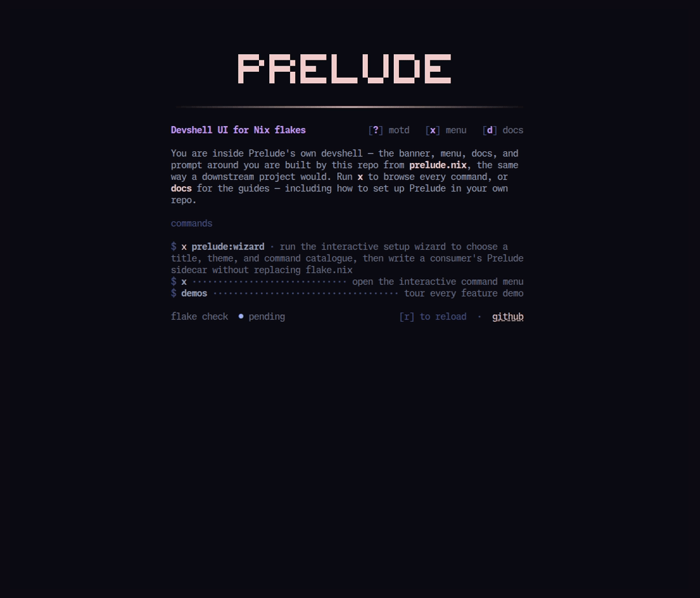
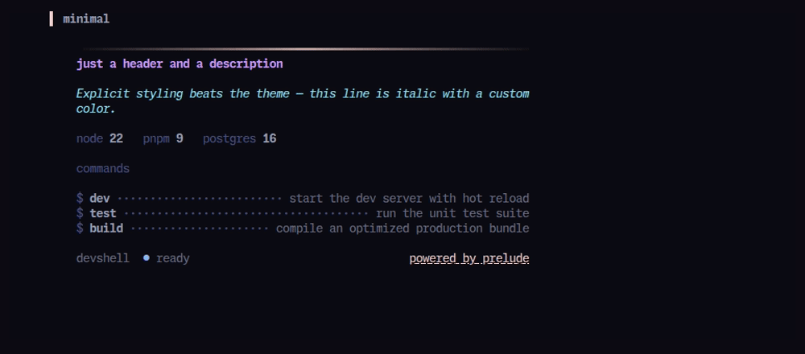
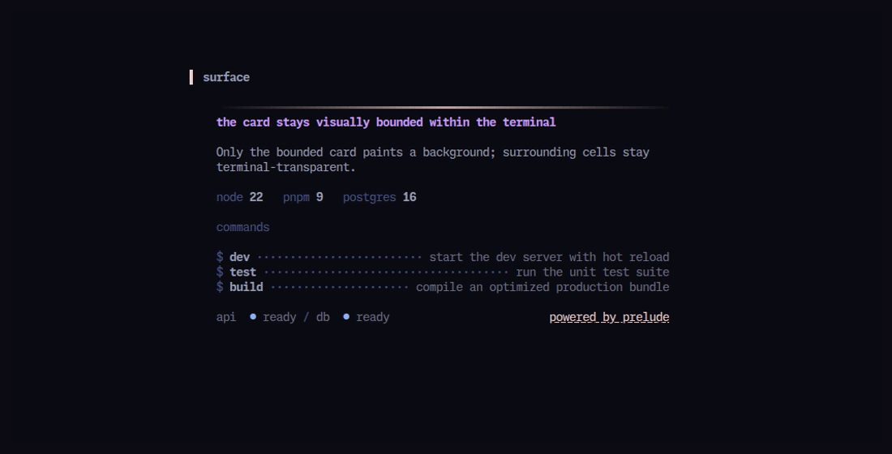

# Terminal showcases

> Generated by `nix run .#docs-sync`. Do not edit this file directly.

## Welcome banner

The MOTD composes project identity, header status, next-step commands,
and navigation shortcuts — all from the repo's own `prelude.nix`.



A still image is available for renderers that do not animate GIFs:
[motd.png](../media/motd.png).

<details>
<summary>Show the configuration used for this recording</summary>

```nix
prelude = {
  commands = {
    build = {
      args = [
        {
          default = ".";
          description = "Flake installable to build; choose a component or demo below, or type a target. Leave empty for the default package.";
          options = [
            ".#prelude-motd"
            ".#prelude-menu"
            ".#prelude-docs"
            ".#example-themes"
            ".#example-default"
          ];
          token = "<target>";
        }
        {
          boolean = true;
          description = "Keep the existing result symlink untouched while Nix builds the selected output.";
          token = "--no-link";
        }
      ];
      description = "build a Prelude flake output, such as the command menu, MOTD, docs viewer, or a feature demo, with optional build logs and result-link control";
      details = ''
        Build a flake output with Nix. Choose one of the component or demo outputs below, or enter another installable manually; leaving the target empty builds the default package.
        Use --no-link to avoid replacing the result symlink, and --print-build-logs to inspect compiler output while a package builds.
      '';
      examples = [
        "x build .#prelude-menu --no-link"
        "x build .#prelude-motd --print-build-logs"
      ];
      exec = "nix build";
      usage = "x build [target] [--no-link] [--print-build-logs]";
    };
    check = {
      description = "build + render smoke tests";
      exec = "nix flake check";
    };
    demos = {
      description = "tour every feature demo";
      exec = "nix run .#examples";
      motd = 3;
    };
    "demos defaults" = {
      description = "preview MOTD from stock setup wizard presets";
      exec = "nix run .#example-default";
    };
    "demos themes" = {
      description = "render a mini motd per theme";
      exec = "nix run .#example-themes";
    };
    "demos titles" = {
      description = "inspect rendered titles";
      exec = "prelude-title-previews prelude";
    };
    docs = {
      description = "browse project documentation";
      exec = "docs";
      key = "d";
    };
    fmt = {
      description = "format nix sources";
      exec = "treefmt .";
    };
    gen = {
      description = "run generation tasks";
      exec = ''
        sync-docs
        record-docs
      '';
    };
    "go:test" = {
      description = "run the Go unit tests";
      exec = "go test -C src ./...";
      group = "go";
    };
    "go:vet" = {
      description = "run Go static analysis";
      exec = "go vet -C src ./...";
      group = "go";
    };
    motd = {
      description = "reprint the welcome banner";
    };
    portal = {
      description = "launch an app, with live health lights";
      exec = "portal";
      key = "p";
    };
    "prelude:previews" = {
      args = [
        {
          description = "Render check name, or several names separated by spaces; leave empty to build every preview. The suggested choices cover the command catalogue, title fonts, and feature demos.";
          options = [
            "menu-list-renders"
            "titles-command-renders"
            "examples-render"
          ];
          token = "<check>";
        }
      ];
      description = "build render checks and print their output to inspect the command catalogue, title fonts, and feature demos without opening an interactive surface";
      details = ''
        Build the selected render checks and print each resulting preview. Leave the argument line empty to inspect every render check, or choose individual checks to focus on the menu, titles, or the feature demos.
      '';
      examples = [
        "x prelude:previews menu-list-renders"
        "x prelude:previews titles-command-renders examples-render"
      ];
      exec = "prelude-previews";
      group = "prelude";
      usage = "x prelude:previews [check ...]";
    };
    "prelude:wizard" = {
      args = [
        {
          default = "prelude.nix";
          description = "Destination path for the generated Nix sidecar; the wizard writes title.txt beside it. Use .work/prelude.nix to try the wizard without replacing this repository's own configuration.";
          options = [
            ".work/prelude.nix"
          ];
          token = "--output";
        }
        {
          description = "Path to a Nix title recipe used to prefill the title text and font before the interactive wizard opens; leave this option unset to choose both in the wizard.";
          token = "--recipe";
        }
      ];
      description = "run the interactive setup wizard to choose a title, theme, and command catalogue, then write a consumer's Prelude sidecar without replacing flake.nix";
      details = ''
        Generate a Prelude sidecar and a sibling title.txt for a consumer project. Choose a different output path when experimenting in this repository so the wizard does not replace our own prelude.nix.
      '';
      examples = [
        "x prelude:wizard --output .work/prelude.nix"
      ];
      exec = "nix run . -- wizard";
      group = "prelude";
      motd = 0;
      usage = "x prelude:wizard [--output path] [--recipe path]";
    };
    "prelude:workspace" = {
      args = [
        {
          boolean = true;
          description = "Use the themed Prelude Starship prompt instead of the fixed `prelude $` prompt, preserving its navigation keymap while the command menu and docs panes move between floating and split layouts.";
          token = "--starship";
        }
      ];
      description = "launch a Bash workspace with Prelude keyboard chords, movable menu and docs panes, and an optional Starship prompt";
      details = ''
        Open an isolated Bash with a movable Prelude menu or docs pane. Alt+X toggles the command menu; Ctrl+] cycles pane layouts so you can inspect description wrapping at different widths.
        The fixed `prelude $` prompt is the default. Enable --starship to use the themed Prelude prompt and its navigation keymap instead.
      '';
      examples = [
        "x prelude:workspace --starship"
      ];
      exec = "prelude-workspace";
      group = "prelude";
      usage = "x prelude:workspace [--starship]";
    };
    record-docs = {
      description = "record stale VHS showcases and sync docs";
      exec = "docs-record";
    };
    sync-docs = {
      description = "regenerate option and showcase markdown";
      exec = "docs-sync";
    };
    "ts:sync" = {
      description = "regenerate the TypeScript API's themes, defaults, and fixtures";
      exec = "ts-sync";
      group = "ts";
    };
    "ts:test" = {
      description = "run the TypeScript API tests";
      exec = "bun --cwd ts test";
      group = "ts";
    };
    "ts:typecheck" = {
      description = "type-check the TypeScript API, including its type tests";
      exec = "bun --cwd=ts install --frozen-lockfile && bun --cwd=ts run typecheck";
      group = "ts";
    };
    x = {
      description = "open the interactive command menu";
      exec = "x";
      key = "m";
    };
  };
  motd = {
    description = {
      text = ''
        You are inside Prelude's own devshell — the banner, menu, docs, and prompt around you are built by this repo from `prelude.nix`, the same way a downstream project would. Run `x` to browse every command, or `docs` for the guides — including how to set up Prelude in your own repo.
      '';
    };
    header = {
      status = {
        flake = {
          check = "nix flake check --no-build >/dev/null 2>&1";
          label = "flake check";
          order = 100;
          output = "light";
        };
      };
      statusHint = {
        links = [
          {
            label = "github";
            url = "https://github.com/darkmatter/prelude";
          }
        ];
      };
      tagline = {
        text = "Devshell UI for Nix flakes";
      };
    };
    title = {
      text = "./nix/internal/title.txt";
    };
  };
  project = "prelude";
};
```

</details>

### Explicit description styling

`prelude.motd.description.foreground` and `.italic` override the active
theme for one description, while `prelude.motd.align = "left"` keeps the
compact banner anchored to the terminal edge.



```nix
prelude = {
  motd = {
    align = "left";
    description = {
      foreground = "#8be9fd";
      italic = true;
      text = "Explicit styling beats the theme — this line is italic with a custom color.";
    };
    header = {
      tagline = {
        text = "just a header and a description";
      };
    };
    margin = {
      top = 0;
    };
  };
  project = "minimal";
};
```

### Bounded opaque card

An opaque `prelude.motd.background` paints only the card. Margins, gutters,
cleared rows, and the surrounding terminal remain transparent. The card
uses all width available inside its configured margins; static keyed
statuses appear in the header without running environment probes.



```nix
prelude = {
  motd = {
    background = true;
    description = {
      text = "Only the bounded card paints a background; surrounding cells stay terminal-transparent.";
    };
    header = {
      status = {
        api = {
          label = "api";
          order = 100;
          status = "ready";
        };
        db = {
          label = "db";
          order = 200;
          status = "ready";
        };
      };
      tagline = {
        text = "the card stays visually bounded within the terminal";
      };
    };
    margin = {
      bottom = 1;
      top = 1;
    };
  };
  project = "surface";
};
```

## Interactive command menu

The menu demonstrates live filtering, command details, argument suggestion
chips, and a command preview. The recording selects `build`, opens its
details, and accepts a target suggestion chip.


A still of the final argument-entry state is available at
[menu.png](../media/menu.png).

<details>
<summary>Show the configuration used for this recording</summary>

```nix
prelude = {
  commands = {
    build = {
      args = [
        {
          default = ".";
          description = "Flake installable to build; choose a component or demo below, or type a target. Leave empty for the default package.";
          options = [
            ".#prelude-motd"
            ".#prelude-menu"
            ".#prelude-docs"
            ".#example-themes"
            ".#example-default"
          ];
          token = "<target>";
        }
        {
          boolean = true;
          description = "Keep the existing result symlink untouched while Nix builds the selected output.";
          token = "--no-link";
        }
      ];
      description = "build a Prelude flake output, such as the command menu, MOTD, docs viewer, or a feature demo, with optional build logs and result-link control";
      details = ''
        Build a flake output with Nix. Choose one of the component or demo outputs below, or enter another installable manually; leaving the target empty builds the default package.
        Use --no-link to avoid replacing the result symlink, and --print-build-logs to inspect compiler output while a package builds.
      '';
      examples = [
        "x build .#prelude-menu --no-link"
        "x build .#prelude-motd --print-build-logs"
      ];
      exec = "nix build";
      usage = "x build [target] [--no-link] [--print-build-logs]";
    };
    check = {
      description = "build + render smoke tests";
      exec = "nix flake check";
    };
    demos = {
      description = "tour every feature demo";
      exec = "nix run .#examples";
      motd = 3;
    };
    "demos defaults" = {
      description = "preview MOTD from stock setup wizard presets";
      exec = "nix run .#example-default";
    };
    "demos themes" = {
      description = "render a mini motd per theme";
      exec = "nix run .#example-themes";
    };
    "demos titles" = {
      description = "inspect rendered titles";
      exec = "prelude-title-previews prelude";
    };
    docs = {
      description = "browse project documentation";
      exec = "docs";
      key = "d";
    };
    fmt = {
      description = "format nix sources";
      exec = "treefmt .";
    };
    gen = {
      description = "run generation tasks";
      exec = ''
        sync-docs
        record-docs
      '';
    };
    "go:test" = {
      description = "run the Go unit tests";
      exec = "go test -C src ./...";
      group = "go";
    };
    "go:vet" = {
      description = "run Go static analysis";
      exec = "go vet -C src ./...";
      group = "go";
    };
    motd = {
      description = "reprint the welcome banner";
    };
    portal = {
      description = "launch an app, with live health lights";
      exec = "portal";
      key = "p";
    };
    "prelude:previews" = {
      args = [
        {
          description = "Render check name, or several names separated by spaces; leave empty to build every preview. The suggested choices cover the command catalogue, title fonts, and feature demos.";
          options = [
            "menu-list-renders"
            "titles-command-renders"
            "examples-render"
          ];
          token = "<check>";
        }
      ];
      description = "build render checks and print their output to inspect the command catalogue, title fonts, and feature demos without opening an interactive surface";
      details = ''
        Build the selected render checks and print each resulting preview. Leave the argument line empty to inspect every render check, or choose individual checks to focus on the menu, titles, or the feature demos.
      '';
      examples = [
        "x prelude:previews menu-list-renders"
        "x prelude:previews titles-command-renders examples-render"
      ];
      exec = "prelude-previews";
      group = "prelude";
      usage = "x prelude:previews [check ...]";
    };
    "prelude:wizard" = {
      args = [
        {
          default = "prelude.nix";
          description = "Destination path for the generated Nix sidecar; the wizard writes title.txt beside it. Use .work/prelude.nix to try the wizard without replacing this repository's own configuration.";
          options = [
            ".work/prelude.nix"
          ];
          token = "--output";
        }
        {
          description = "Path to a Nix title recipe used to prefill the title text and font before the interactive wizard opens; leave this option unset to choose both in the wizard.";
          token = "--recipe";
        }
      ];
      description = "run the interactive setup wizard to choose a title, theme, and command catalogue, then write a consumer's Prelude sidecar without replacing flake.nix";
      details = ''
        Generate a Prelude sidecar and a sibling title.txt for a consumer project. Choose a different output path when experimenting in this repository so the wizard does not replace our own prelude.nix.
      '';
      examples = [
        "x prelude:wizard --output .work/prelude.nix"
      ];
      exec = "nix run . -- wizard";
      group = "prelude";
      motd = 0;
      usage = "x prelude:wizard [--output path] [--recipe path]";
    };
    "prelude:workspace" = {
      args = [
        {
          boolean = true;
          description = "Use the themed Prelude Starship prompt instead of the fixed `prelude $` prompt, preserving its navigation keymap while the command menu and docs panes move between floating and split layouts.";
          token = "--starship";
        }
      ];
      description = "launch a Bash workspace with Prelude keyboard chords, movable menu and docs panes, and an optional Starship prompt";
      details = ''
        Open an isolated Bash with a movable Prelude menu or docs pane. Alt+X toggles the command menu; Ctrl+] cycles pane layouts so you can inspect description wrapping at different widths.
        The fixed `prelude $` prompt is the default. Enable --starship to use the themed Prelude prompt and its navigation keymap instead.
      '';
      examples = [
        "x prelude:workspace --starship"
      ];
      exec = "prelude-workspace";
      group = "prelude";
      usage = "x prelude:workspace [--starship]";
    };
    record-docs = {
      description = "record stale VHS showcases and sync docs";
      exec = "docs-record";
    };
    sync-docs = {
      description = "regenerate option and showcase markdown";
      exec = "docs-sync";
    };
    "ts:sync" = {
      description = "regenerate the TypeScript API's themes, defaults, and fixtures";
      exec = "ts-sync";
      group = "ts";
    };
    "ts:test" = {
      description = "run the TypeScript API tests";
      exec = "bun --cwd ts test";
      group = "ts";
    };
    "ts:typecheck" = {
      description = "type-check the TypeScript API, including its type tests";
      exec = "bun --cwd=ts install --frozen-lockfile && bun --cwd=ts run typecheck";
      group = "ts";
    };
    x = {
      description = "open the interactive command menu";
      exec = "x";
      key = "m";
    };
  };
  project = "prelude";
};
```

</details>
